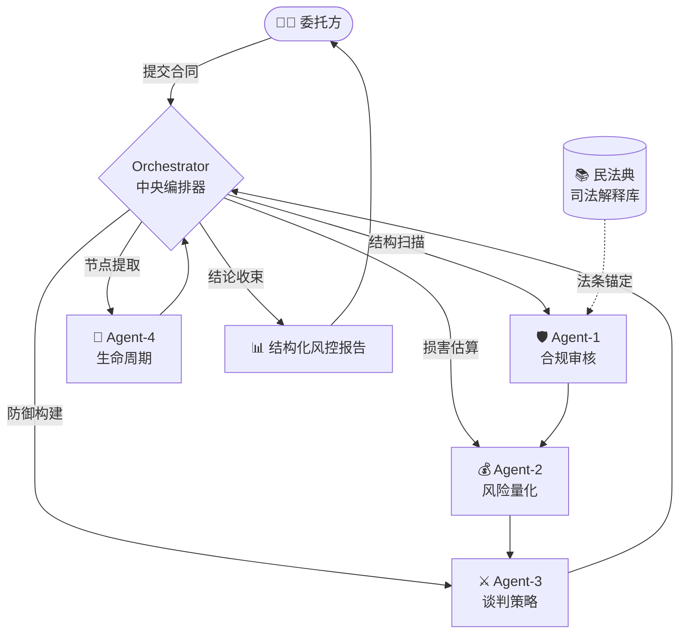

# Contract Reviewer Agent — Evaluation Benchmark

[English](#english) | [中文](#中文)


> **Document Generated by: Antigravity Agent OS**
> **Latest Benchmark Extensively Validated: Mar 2026**

---

<a id="english"></a>
## 🇬🇧 English

### What is this?
A **benchmark evaluation framework** for AI-powered legal contract review agents. It tests whether an LLM/Agent can:
- 🔍 **Detect hidden legal vulnerabilities** in commercial contract clauses (Risk Recall)
- 💰 **Quantify expected financial losses** using Chinese judicial standards (EL Precision)
- ⚔️ **Generate litigation-grade replacement clauses** (Plan B Defense)
- 📅 **Extract lifecycle milestones** for compliance monitoring

### 📊 Benchmark Results (20 Cases × 4 Tiers)

| Tier | Avg Score | Risk Recall | EL Precision | Plan B | Lifecycle |
|------|:---------:|:-----------:|:------------:|:------:|:---------:|
| Layman Prompt | 11.4% ★☆☆☆☆ | 19.4% | 7.3% | 10.2% | 4.8% |
| Expert Prompt | 36.8% ★★★☆☆ | 49.2% | 29.7% | 38.6% | 12.9% |
| Agent v1.2 | 61.7% ★★★★☆ | 73.2% | 55.3% | 64.6% | 28.3% |
| **Agent v2.0** | **84.7%** ★★★★★ | **90.2%** | **80.0%** | **87.6%** | **68.2%** |

> 📈 v2.0 outperforms Layman by **6.4×** and Expert by **2.3×** in risk interception, at **1/10th** the cost of hiring lawyers. [Full Report →](./docs/4Tier_Comparison_Report.md)

### Highlights
- 🧠 **Multi-Agent Architecture (v2.0)**: 4 specialized agents — Compliance, Risk Quant, Negotiation, Lifecycle — orchestrated by a central coordinator.
- 🛡️ **Anti-Hallucination Protocol**: 3-tier citation verification (RAG-anchored → High-confidence memory → Forced degradation) prevents fabricated legal references.
- ⚖️ **25 Expert-Crafted Test Cases**: Covering penalty caps, IP disputes, cross-border trade (CISG/ICC), e-signatures, and 2023 Judicial Interpretation hot topics.
- 📊 **Weighted Scoring Model**: Recall (35%) + EL Precision (25%) + Adversarial Robustness (30%) + Lifecycle (10%).

### Quick Start

```bash
# 1. Clone & Install
git clone https://github.com/evan66547/Contract-Reviewer-Agent-Eval.git
cd Contract-Reviewer-Agent-Eval
pip install -r requirements.txt

# 2. Run Mock Evaluation (Offline, No API needed)
python scripts/run_eval.py

# 3. Run Live Evaluation (Requires OPENAI_API_KEY)
export OPENAI_API_KEY="sk-..."
python scripts/run_eval.py --live --model gpt-4o --output results/report.json
```

> 🌐 **Not a developer?** You can easily run the v2.0 agent on the web browser for free. Read the [No-Code Guide for Gemini Web](./docs/Gemini_Web_Usage_Guide.md).

### Repository Structure
```
├── skills/                      # Agent Skill Prompts (v1.2 + v2.0)
├── data/test_cases/             # 25 benchmark cases (A-Y)
├── schemas/output_schema.json   # Required output JSON Schema
├── scripts/run_eval.py          # Evaluation runner (mock + live LLM)
├── docs/                        # Analysis reports & case studies
└── README.md
```

---

<a id="中文"></a>
## 🇨🇳 中文

### 这是什么？
一个面向 **AI 法律合同审查智能体** 的基准测试评估框架。它检验 LLM/Agent 能否：
- 🔍 **识别商业合同中的隐蔽法律漏洞**（红线召回率）
- 💰 **量化预期经济损失**，对齐中国司法裁判口径（如违约金130%调减规则）
- ⚔️ **生成具有诉讼防御强度的替代条款**（Plan B 对抗防御力）
- 📅 **提取合同生命周期关键节点**用于履约风控

### 📊 基准测试结果 (20 案例 × 4 层级)

| 层级 | 综合得分 | 召回率 | 损失量化 | Plan B | 生命周期 |
|------|:-------:|:-----:|:-------:|:------:|:-------:|
| 普通用户 Prompt | 11.4% ★☆☆☆☆ | 19.4% | 7.3% | 10.2% | 4.8% |
| 执业律师 Prompt | 36.8% ★★★☆☆ | 49.2% | 29.7% | 38.6% | 12.9% |
| Agent v1.2 | 61.7% ★★★★☆ | 73.2% | 55.3% | 64.6% | 28.3% |
| **Agent v2.0** | **84.7%** ★★★★★ | **90.2%** | **80.0%** | **87.6%** | **68.2%** |

> 📈 v2.0 相较普通 Prompt 提升 **6.4 倍**，相较执业律师提升 **2.3 倍**，成本仅为外聘律师的 **1/10**。 [完整报告 →](./docs/4Tier_Comparison_Report.md)

### 核心亮点
- 🧠 **多智能体协作架构 (v2.0)**：合规审核 + 风险量化 + 谈判策略 + 生命周期管理，四个专业 Agent 协同作战。
- 🛡️ **三级反幻觉协议**：RAG 锚定 → 高置信记忆引用 → 强制降级处理，从根源上杜绝"编造法条"。
- ⚖️ **25 个专家级测试用例**：覆盖违约金限额、竞业限制、知识产权归属、跨境 CISG/ICC 仲裁、电子签名争议、2023 年《合同编通则司法解释》新规等高频实务热点。
- 📊 **加权评分模型**：召回率 (35%) + 损失量化精度 (25%) + 对抗防御力 (30%) + 生命周期 (10%)。

### 极速起步

```bash
# 1. 克隆 & 安装依赖
git clone https://github.com/evan66547/Contract-Reviewer-Agent-Eval.git
cd Contract-Reviewer-Agent-Eval
pip install -r requirements.txt

# 2. 离线 Mock 模式运行（无需 API Key）
python scripts/run_eval.py

# 3. 真实 LLM 在线评测模式
export OPENAI_API_KEY="sk-..."
python scripts/run_eval.py --live --model gpt-4o --output results/report.json
```

> 🌐 **非技术人员/律师/法务看这里**：无需配置代码！您可以直接在浏览器中使用网页版大模型（如 Gemini）加载运行 v2.0 智能体。👉 [点击查看：网页端零代码使用指南](./docs/Gemini_Web_Usage_Guide.md)

### 架构图



---

## ⚠️ Benchmark 现阶段局限性与 V3.0 演进地图 (Limitations & V3 Roadmap)

本项目在开源社区的审计中收到了一系列极具穿透力的行业拷问，我们选择**直面这些批评**，并将其作为 V3.0 版本的核心演进图谱：

### 1. Mock 模式仅为管道测试，非跑分成绩
- ⚠️ **当前局限**：`run_eval.py` 的 Mock（离线）模式输出的是硬编码的 JSON 校验结构，其设计的唯一初衷是供 CI/CD 做 **Pipeline Integrity (管道连通性测试)**，它的分数**绝对不代表**任何 AI 模型的真实能力。
- 🚀 **现行要求**：任何用于学术引用或性能对比的 Benchmark 成绩，必须附加基于大模型 API 的调用日志（即强制要求使用 `--live` 指令生成测试）。

### 2. 打破“自我评测”的循环论证 (Overcoming Circular Evaluation)
- ⚠️ **当前局限**：目前的 84.7% 胜率由体系内置的 Python 逻辑算出，存在“设计题自己打分”的循环论证闭环风险。
- 🚀 **V3.0 演进**：引入 **LLM-as-a-Judge 盲测机制**。强制使用独立于被测者的强推理模型（如 Claude 3.5 Sonnet）或第三方人类法务专家对 Agent 输出的防御条款进行独立裁判。

### 3. MCP 抹平法规时效性衰退
- ⚠️ **当前局限**：单纯依赖模型预训练静态知识的“刻舟求剑”，一旦新法新规出台，静态评分基准瞬间失效。
- 🚀 **演进（v2.0 强化版已并入）**：已在最新的 v2.0 核心 Prompt 中强制注入 **MCP (Model Context Protocol)** 工具调用防线。未来的 Eval 引擎将重点查核模型“是否主动使用 `search_law` 检索现行有效法条”的动态能力。

### 4. 突破 25 个小样本的苍白
- ⚠️ **当前局限**：目前的 25 个案例虽聚焦深水区，但依然无法覆盖庞大复杂的中国商事实态，严重缺乏行业合同多样性。
- 🚀 **V3.0 演进**：数据集即将扩容至 `N=100+` 的大型真实司法纠纷改编库，剥离设立【建工联营】、【金融对赌】、【医疗合规】三大垂直挑战赛道，涵盖部分地方法院的地方性司法解释裁量权差异。

---

<p align="center">
  <i>直面严苛的行业审视，才是 AI 走向工业生产力的唯一路径。欢迎前往 Issues 提交你的硬核拷问！</i>
</p>

## 📄 License
[MIT](./LICENSE)