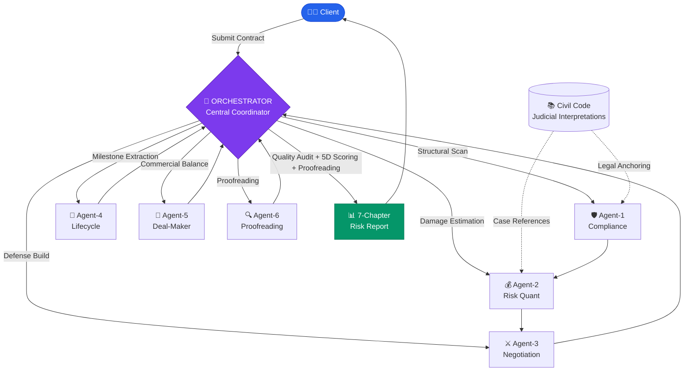

<div align="center">

# ⚖️ Contract Reviewer Agent — Evaluation Benchmark

**Multi-Agent Orchestration Network for Enterprise-Grade Contract Risk Review**

[](./LICENSE)
[](https://www.python.org)
[](#-tier-4-agent-v21--orchestrator--6-agent-network)
[](#-what-is-this)
[](https://github.com/evan66547/Contract-Reviewer-Agent-Eval/pulls)

<a href="./README.md"></a>
<a href="./README.zh-CN.md"></a>

[What is this?](#-what-is-this) · [Capability Gap](#-four-tier-capability-gap-verification) · [Architecture](#-architecture-overview-by-version) · [Quick Start](#-quick-start) · [v1.2 Lite Release](./docs/releases/v1.2-lite-release.md) · [Case Study](./docs/Comparative_Analysis_Case_A.md)

</div>

---

## 💡 What is this?

A **Dual-Track Legal AI Framework** — both an objective evaluation benchmark and a production-grade enterprise workflow. Built on China's *Civil Code* and latest judicial interpretations, this framework assesses AI agents across **four business dimensions**:

| Dimension | Description | Core Metric |
|:---:|---|:---:|
| 🔍 **Risk Recall** | Identify compliance risks and contractual deficiencies in commercial agreements | **Risk Recall Rate** |
| 💰 **EL Precision** | Calculate expected loss (EL) margins in alignment with Chinese judicial standards | **Loss Quantification Accuracy** |
| ⚔️ **Plan B Defense** | Draft alternative clauses with litigation-grade defensive utility | **Defensive Strength** |
| 📅 **Lifecycle** | Extract lifecycle milestones for corporate fulfillment and compliance monitoring | **Lifecycle Tracking** |

---

## 📊 Four-Tier Capability Gap Verification

> [!CAUTION]
> **Compliance Disclaimer**
> 1. **No marketing claims**: Scores below are self-evaluated projections without third-party audit. **Do not** use them as capability certifications for clients, regulators, or third parties.
> 2. **Adversarial testing required**: For high-stakes scenarios (M&A earn-outs, financial derivatives, IP litigation), users **must** supplement with Prompt Injection and other adversarial test cases.

<div align="center">

| | Naive Prompt | Lawyer Prompt | Agent v1.2 | **Agent v2.1** |
|---|:---:|:---:|:---:|:---:|
| **Overall Score** | 11.4% ☆ | 36.8% ★★★ | 61.7% ★★★★ | **84.7% ★★★★★** |
| 🔍 Risk Recall | 19.4% | 49.2% | 73.2% | **90.2%** |
| 💰 EL Precision | 7.3% | 29.7% | 55.3% | **80.0%** |
| ⚔️ Plan B | 10.2% | 38.6% | 64.6% | **87.6%** |
| 📅 Lifecycle | 4.8% | 12.9% | 28.3% | **68.2%** |

</div>

> 📄 **Why does v2.1 crush the other three tiers on a single clause?** See the full case study → [**Multi-Tier Prompt Capability Gap Analysis**](./docs/Comparative_Analysis_Case_A.md), with a line-by-line teardown of a real penalty-cap clause.

---

## 🏗 Architecture Overview by Version

Four capability tiers from "bare model" to "multi-agent orchestration", demonstrating the massive quality gap.

---

### TIER 1 & TIER 2: Naive Prompt / Lawyer Prompt

<table>
<tr>
<td width="50%">

**🙋 TIER 1: Naive Prompt**

The most basic single-turn approach — asking the LLM "review this contract for me."

- ❌ Surface-level text diff only (e.g. noticing asymmetric penalty ratios)
- ❌ No quantification awareness; cannot perceive risk exposure
- ❌ May mistake fatal loopholes (e.g. liability caps) as "protection clauses"
- 📊 Overall Score: **11.4%**

</td>
<td width="50%">

**👨‍⚖️ TIER 2: Lawyer Prompt**

LLM given a "10-year senior counsel" persona, instructed to apply *Civil Code* knowledge.

- ✅ Detects gaps between liability caps and actual damages
- ⚠️ Provides alternative clauses, but insufficient — fails to sever core risk
- ❌ Misses penetrating exemptions for IP infringement / fundamental breach
- 📊 Overall Score: **36.8%**

</td>
</tr>
</table>

---

### 🔬 TIER 3: Agent v1.2 — Monolithic Intelligence

> **File**: [`skills/senior-legal-contract-reviewer-v1/SKILL.md`](./skills/senior-legal-contract-reviewer-v1/SKILL.md)
>
> **Bilingual Intro Layout (new)**: [`skills/senior-legal-contract-reviewer-v1.2-lite/README.md`](./skills/senior-legal-contract-reviewer-v1.2-lite/README.md)

A ~2,000-word precision-engineered prompt with rigid principles: "Extreme Adversarial Defense" and "No Mechanical Balance."

<table>
<tr><td>

**Core Capabilities**
- ✅ Precision surgery on "arithmetic asymmetry" smokescreens, targeting penalty-cap shells
- ✅ Quantification using Civil Code Art. 584 (make-whole principle) + 130% penalty reduction scale
- ✅ Litigation-grade exemption clauses (unlimited for confidentiality / IP infringement)
- ⚠️ Overly aggressive posture; insufficient commercial negotiation finesse
- 📊 Overall Score: **61.7%**

**Design Philosophy**
> *"When you find a loophole, use a scalpel to excise it with precision. Don't seek balance — pursue defensive perfection."*

</td></tr>
</table>

---

### 🧠 TIER 4: Agent v2.1 — ORCHESTRATOR + 6-Agent Network

> **File**: [`skills/senior-legal-contract-reviewer-v2/SKILL.md`](./skills/senior-legal-contract-reviewer-v2/SKILL.md)
>
> 📊 Overall Score: **84.7%** — Leading across all four dimensions

The **core evaluation architecture**. ORCHESTRATOR (central coordinator) directs 6 specialized Agents for concurrent review, then consolidates findings, audits quality, and outputs a 7-chapter structured report.

<table>
<tr>
<td width="50%">

**🧠 Six Specialized Agents**

| Agent | Role | Responsibility |
|:---:|---|---|
| 🛡️ Agent-1 | Compliance | Red-line scanning against Civil Code & judicial interpretations |
| 💰 Agent-2 | Risk Quant | EL calculation with penalty reduction rules (130% cap) |
| ⚔️ Agent-3 | Negotiation | BATNA analysis & litigation-grade alternative clauses |
| 📅 Agent-4 | Lifecycle | Milestone extraction, deadline blackhole detection |
| 🤝 Agent-5 | Deal-Maker | Commercial friction reduction for overly aggressive terms |
| 🔍 Agent-6 | **Proofreading** | **Typos, grammar, legal term misuse, cross-reference errors** |

</td>
<td width="50%">

**📊 ORCHESTRATOR Report Engine**

- **5-Dimension Scoring** (Compliance 30% / Financial 25% / Defense 20% / Fulfillment 15% / Commercial 10%)
- **Agent Quality Audit Matrix** (Legal citation accuracy / Coverage / Logical consistency / Actionability)
- **7-Chapter Report Structure**:
  1. Review Summary
  2. 5-Dimension Scorecard
  3. Per-Agent Findings
  4. Agent Quality Audit
  5. Risk Heatmap Matrix
  6. Amendment Recommendations
  7. Disclaimer

</td>
</tr>
</table>

> [!TIP]
> **Breakthrough discovery by v2.1**: When reviewing a penalty-cap clause, Agent-4 (Lifecycle) uncovered a fatal loophole missed by all three other tiers — *"At a daily penalty rate of 0.05%, it would take 400 consecutive days of breach to hit the 20% cap"* — meaning the aggrieved party could not realistically accumulate enough penalties to trigger termination rights within a year. See → [Full Case Study](./docs/Comparative_Analysis_Case_A.md)

---

### 🏢 v2.2 Enterprise Edition

> **File**: [`skills/senior-legal-contract-reviewer-v2.2-enterprise/SKILL.md`](./skills/senior-legal-contract-reviewer-v2.2-enterprise/SKILL.md)

Production-grade workflow for real-world legal departments (independent from the benchmark). Builds on v2.1 with Agent-0 security pre-check and audit trail capabilities, forming an ORCHESTRATOR + 7-Agent pipeline.

| Feature | Description |
|---|---|
| 🔒 **Agent-0 Security Pre-Check** | Prompt injection defense; AML / data export / sanctions detection → automatic escalation to human review |
| 📋 **Mandatory Input Gating** | Requires `{party_role}`, `{jurisdiction}`, `{industry}`, `{approval_tier}` before execution |
| 🔖 **Audit Metadata Matrix** | Outputs `risk_tag`, `legal_citation`, `confidence`, `escalation_flag`, `review_timestamp` — OA/ERP-ready |

---

## 🚀 Quick Start

```bash
# 1. Clone & install dependencies
git clone https://github.com/evan66547/Contract-Reviewer-Agent-Eval.git
cd Contract-Reviewer-Agent-Eval
pip install -r requirements.txt

# 2. Offline mock mode (no API key needed — quick pipeline demo)
python scripts/run_eval.py

# 3. Live evaluation + 7-chapter structured report
export OPENAI_API_KEY="sk-..."                          # OpenAI
# or export GOOGLE_API_KEY="..."                        # Gemini
python scripts/run_eval.py --live --model gpt-4o \
  --report --report_output results/risk_report_v2.1.md
```

> [!NOTE]
> 🌐 **Non-developers / Lawyers / Legal counsel**: No code setup needed! You can run the v2.0 agent directly in your browser using a web-based LLM (e.g. Gemini).
> 👉 [**No-Code Web Usage Guide**](./docs/Gemini_Web_Usage_Guide.md)

---

## 🗺 Architecture Diagram



---

## 📂 Project Structure

```
Contract-Reviewer-Agent-Eval/
│
├── 📁 skills/                                          # Agent Prompt Engineering
│   ├── senior-legal-contract-reviewer-v1/              # v1.2 Monolithic Intelligence
│   ├── senior-legal-contract-reviewer-v1.2-lite/       # v1.2 Lite Skill Package (Bilingual Intro)
│   ├── senior-legal-contract-reviewer-v2/              # v2.1 ORCHESTRATOR + 6-Agent (Benchmark)
│   └── senior-legal-contract-reviewer-v2.2-enterprise/ # v2.2 ORCHESTRATOR + 7-Agent (Enterprise)
│
├── 📁 data/test_cases/                                 # 25 High-Risk Commercial Contract Benchmarks (A-Y)
├── 📁 schemas/output_schema.json                       # Output JSON Schema (Draft-07)
│
├── 📁 scripts/
│   ├── run_eval.py                                     # Evaluation Script (mock + live LLM)
│   ├── report_generator.py                             # ORCHESTRATOR 7-Chapter Report Generator
│   └── run_eval.sh                                     # Shell Launcher
│
├── 📁 docs/
│   ├── Comparative_Analysis_Case_A.md                  # Multi-Tier Capability Gap Analysis
│   └── Gemini_Web_Usage_Guide.md                       # No-Code Web Usage Guide
│
├── 📁 results/                                         # Evaluation Outputs & Risk Reports
└── README.md
```

---

<div align="center">

### 📄 License

This project is open-sourced under the [MIT License](./LICENSE).

---

**Document Generated by: Antigravity Agent OS** · **Latest Benchmark: Mar 2026**

</div>
