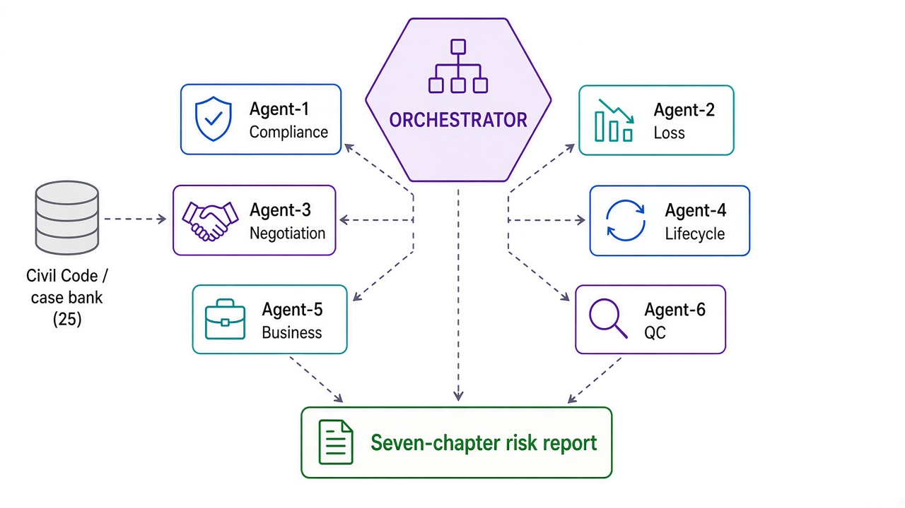

# Contract Reviewer Agent Eval

**Benchmark for AI legal contract-review agents — 25 Civil Code–aligned cases covering recall, loss quantification, Plan B, and lifecycle.**

[](./LICENSE)
[](https://www.python.org)
[](./README.zh-CN.md)

| Dimension | What we measure |
| --- | --- |
| Risk recall | Find compliance / legal defects |
| Loss quantification | Expected breach loss under judicial practice |
| Plan B defense | Litigation-ready alternative clauses |
| Lifecycle | Deadlines and trigger nodes |

<p align="center">
  
</p>

**Disclaimer:** Scores in deeper docs are self-reported architecture projections — not third-party audited marketing claims.

## Quick start

```bash
git clone https://github.com/evan66547/Contract-Reviewer-Agent-Eval.git
cd Contract-Reviewer-Agent-Eval
pip install -r requirements.txt

# Offline mock (no API key)
python scripts/run_eval.py

# Live + seven-chapter report
export OPENAI_API_KEY="sk-..."
python scripts/run_eval.py --live --model gpt-4o \
  --report --report_output results/risk_report_v2.1.md
```

Non-coders: load skills in a web LLM — see [docs/Gemini_Web_Usage_Guide.md](./docs/Gemini_Web_Usage_Guide.md).

## Layout

```text
skills/          # v1.2 · v2.1 orchestrator+6 · v2.2 enterprise
data/test_cases/ # 25 cases (A–Y)
scripts/         # run_eval.py, report_generator.py
schemas/         # output JSON Schema
docs/            # deep dives + full README archive
```

## Deeper docs

- [Full README (archived detail)](./docs/FULL_README.md) — tier tables, architecture mermaid, enterprise notes
- [Comparative analysis (Case A)](./docs/Comparative_Analysis_Case_A.md)
- [Chinese README](./README.zh-CN.md)

## License

[MIT](./LICENSE)
