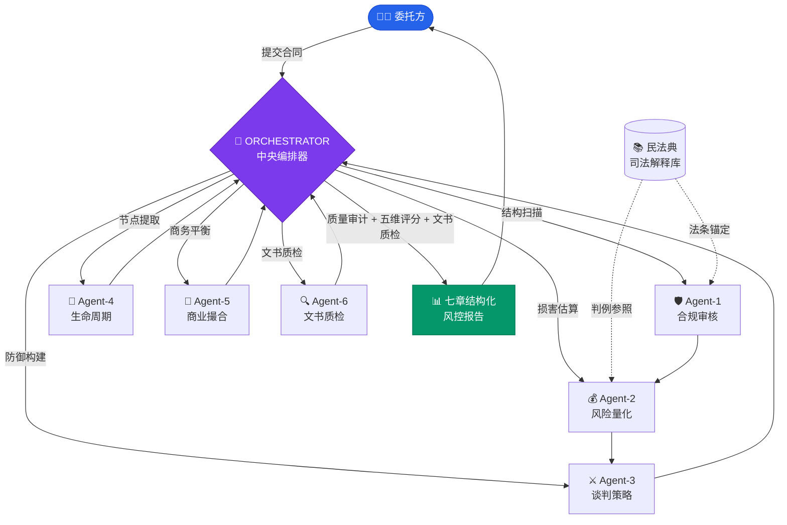

<div align="center">

# ⚖️ 合同审查智能体 — 评测基准

**用 AI 多智能体编排网络，实现企业级合同风险的「全维度立体审查」**

[](./LICENSE)
[](https://www.python.org)
[](#-tier-4agent-v21--orchestrator--6-agent-编排网络)
[](#-这是什么)
[](https://github.com/evan66547/Contract-Reviewer-Agent-Eval/pulls)

<a href="./README.md"></a>
<a href="./README.zh-CN.md"></a>

[这是什么？](#-这是什么) · [四层代差验证](#-四层能力代差验证) · [架构概览](#-各版本架构概览) · [极速起步](#-极速起步) · [代差对比报告](./docs/Comparative_Analysis_Case_A.md)

</div>

---

## 💡 这是什么？

本项目旨在构建一个**「双轨制」法务 AI 架构**——不仅包含针对大模型能力的测评基准引擎（Benchmark），亦提供可被企业法务部直接调用的合规工作流（Enterprise Workflow）。基于中国《民法典》及最新司法解释，本框架主要考核人工智能体在以下**四个业务维度**的效能：

| 维度 | 考核内容 | 核心指标 |
|:---:|---|:---:|
| 🔍 **风险召回** | 审查并识别合同文本中的合规瑕疵与法律风险 | **风险召回率** |
| 💰 **损失量化** | 依据司法解释裁判口径，动态量化预期违约损失 | **损失量化精度** |
| ⚔️ **Plan B 防御** | 拟定具备诉讼防御与风险隔离效力的替代条款 | **Plan B 防御力** |
| 📅 **生命周期** | 提取合同履约期限及违约触发节点，支持风控闭环 | **生命周期追踪** |

---

## 📊 四层能力代差验证

> [!CAUTION]
> **实盘应用与合规免责声明**
> 1. **禁止营销宣示**：下表数据为「自评 + 自打分 + 无第三方审计」体系下生成的理论架构投影。**绝对禁止**将其作为对客户、监管机构或第三方的"AI 能力定性证明"或"合规背书"。
> 2. **高危环境的独立对抗指标**：若将本框架用于高对抗性业务（并购对赌、金融衍生品、知识产权诉讼等），使用者**必须**自行增补 Prompt Injection 等对抗性测试用例。

<div align="center">

| | 普通 Prompt | 执业律师 Prompt | Agent v1.2 | **Agent v2.1** |
|---|:---:|:---:|:---:|:---:|
| **综合得分** | 11.4% ☆ | 36.8% ★★★ | 61.7% ★★★★ | **84.7% ★★★★★** |
| 🔍 风险召回 | 19.4% | 49.2% | 73.2% | **90.2%** |
| 💰 损失量化 | 7.3% | 29.7% | 55.3% | **80.0%** |
| ⚔️ Plan B | 10.2% | 38.6% | 64.6% | **87.6%** |
| 📅 生命周期 | 4.8% | 12.9% | 28.3% | **68.2%** |

</div>

> 📄 **想了解为何 v2.1 能在单条条款上碾压其他三个层级？** 请阅读完整实测报告 → [**多层级提示词能力代差对比分析**](./docs/Comparative_Analysis_Case_A.md)，内含一个真实违约金封顶条款的逐级穿透式详解。

---

## 🏗 各版本架构概览

下文对本框架涉及的**四个能力层级**逐一介绍，帮助读者理解从"裸模型"到"多智能体编排"的巨大质效代差。

---

### TIER 1 & TIER 2：普通 Prompt / 律师 Prompt

<table>
<tr>
<td width="50%">

**🙋 TIER 1：普通用户 Prompt**

最基础的单轮对话方式——直接向大模型提问"帮我看看这个合同"。

- ❌ 只能识别表面文字差异（如甲乙双方违约金比例不一致）
- ❌ 无量化意识，无法感知风险敞口
- ❌ 容易将致命漏洞（如违约金封顶）误认为"保护条款"
- 📊 综合得分：**11.4%**

</td>
<td width="50%">

**👨‍⚖️ TIER 2：执业律师 Prompt**

为大模型赋予"十年法务"人设，要求运用《民法典》知识审查。

- ✅ 能识别出责任限额与实际损失之间的鸿沟
- ⚠️ 给出替代条款但不够彻底，未切除核心风险
- ❌ 缺乏对"根本违约 / 知产侵权"的穿透性豁免切割
- 📊 综合得分：**36.8%**

</td>
</tr>
</table>

---

### 🔬 TIER 3：Agent v1.2 — 单体智能

> **文件位置**：[`skills/senior-legal-contract-reviewer-v1/SKILL.md`](./skills/senior-legal-contract-reviewer-v1/SKILL.md)

v1.2 是一份约 2,000 字的精心设计的提示工程产物，包含「极端对抗防御体系」和「禁止机械平衡」等刚性原则。

<table>
<tr><td>

**核心能力**
- ✅ 精准剥离「算术不对等」烟雾弹，直击违约金限额外壳
- ✅ 运用《民法典》第 584 条填平原则 + 违约金 130% 调减尺度进行量化
- ✅ 交出诉讼级别豁免条款（保密/知产侵权不设限）
- ⚠️ 但战斗力过于硬核，商业谈判润滑度不足
- 📊 综合得分：**61.7%**

**设计哲学**
> *"发现一个漏洞，就要用一把手术刀精准切除它。不追求平衡，只追求防御极致。"*

</td></tr>
</table>

---

### 🧠 TIER 4：Agent v2.1 — ORCHESTRATOR + 6-Agent 编排网络

> **文件位置**：[`skills/senior-legal-contract-reviewer-v2/SKILL.md`](./skills/senior-legal-contract-reviewer-v2/SKILL.md)
>
> 📊 综合得分：**84.7%** — 在所有四个维度上均大幅领先其他层级

v2.1 是本项目的**核心测评架构**，采用 ORCHESTRATOR（中央编排器）指挥 6 个专业化 Agent 并发审查，最终由 ORCHESTRATOR 统一收束、质量审计，并输出七章结构化报告。

<table>
<tr>
<td width="50%">

**🧠 六大专业 Agent**

| Agent | 角色 | 职责 |
|:---:|---|---|
| 🛡️ Agent-1 | 合规审核 | 依据《民法典》及司法解释进行红线扫描 |
| 💰 Agent-2 | 风险量化 | 计算预期损失（EL），含违约金 130% 调减规则 |
| ⚔️ Agent-3 | 谈判策略 | BATNA 分析与诉讼级替代条款起草 |
| 📅 Agent-4 | 生命周期 | 履约节点提取，期限黑洞检测 |
| 🤝 Agent-5 | 商业撮合 | 为强硬 Plan B 提供降温话术，降低谈判摩擦 |
| 🔍 Agent-6 | **文书质检** | **错别字/语病/术语误用/标点符号/前后矛盾** |

</td>
<td width="50%">

**📊 ORCHESTRATOR 报告引擎**

- **五维风险评分**（合规 30% / 财务 25% / 攻防 20% / 履约 15% / 商业 10%）
- **Agent 质量核查矩阵**（法条引准 / 覆盖度 / 逻辑自洽 / 可操作性）
- **七章报告结构**：
  1. 审查概览
  2. 五维评分卡
  3. 各 Agent 发现详情
  4. Agent 质量审计
  5. 风险热力矩阵
  6. 修改建议
  7. 免责声明

</td>
</tr>
</table>

> [!TIP]
> **v2.1 的突破性发现案例**：在审查违约金封顶条款时，Agent-4（生命周期）发现了一个其他三个层级完全遗漏的致命漏洞——*"以万分之五的每日违约金比例，需要连续违约 400 天才能触及 20% 的封顶上限"*——这意味着权利方在一年内几乎不可能通过违约金累积来触发解约权。详见 → [完整对比分析](./docs/Comparative_Analysis_Case_A.md)

---

### 🏢 v2.2 Enterprise 生产专版

> **文件位置**：[`skills/senior-legal-contract-reviewer-v2.2-enterprise/SKILL.md`](./skills/senior-legal-contract-reviewer-v2.2-enterprise/SKILL.md)

针对真实企业法务部交付场景部署的工作流实体（独立于测评基准运行），在 v2.1 基础上新增 Agent-0 前置安全与审计追溯能力，形成 ORCHESTRATOR + 7-Agent 完整流线。

| 特性 | 说明 |
|---|---|
| 🔒 **Agent-0 前置风控** | 识别并阻断 Prompt 注入攻击；反洗钱/数据出境/制裁等高危合规领域触发人工升级 |
| 📋 **强约束校验输入** | 要求业务端明确提供 `{我方角色}`、`{适用法域}`、`{行业限制}`、`{审批层级}` 等核心参数 |
| 🔖 **结构化审计矩阵** | 输出包含 `风险标签`、`法源实证`、`置信度`、`升级标志`、`审查时间戳` 的元数据，支持 OA/ERP 集成 |

---

## 🚀 极速起步

```bash
# 1. 克隆 & 安装依赖
git clone https://github.com/evan66547/Contract-Reviewer-Agent-Eval.git
cd Contract-Reviewer-Agent-Eval
pip install -r requirements.txt

# 2. 离线 Mock 模式运行（无需 API Key，快速体验 pipeline）
python scripts/run_eval.py

# 3. 在线评测 + 生成七章结构化报告
export OPENAI_API_KEY="sk-..."                          # OpenAI
# 或 export GOOGLE_API_KEY="..."                        # Gemini
python scripts/run_eval.py --live --model gpt-4o \
  --report --report_output results/risk_report_v2.1.md
```

> [!NOTE]
> 🌐 **非技术人员 / 律师 / 法务**：无需配置任何代码！您可以直接在浏览器中使用网页版大模型（如 Gemini）加载运行 v2.0 智能体。
> 👉 [**点击查看：网页端零代码使用指南**](./docs/Gemini_Web_Usage_Guide.md)

---

## 🗺 架构图



---

## 📂 项目结构

```
Contract-Reviewer-Agent-Eval/
│
├── 📁 skills/                                          # 智能体提示词工程
│   ├── senior-legal-contract-reviewer-v1/              # v1.2 单体智能
│   ├── senior-legal-contract-reviewer-v2/              # v2.1 ORCHESTRATOR + 6-Agent（基准测评版）
│   └── senior-legal-contract-reviewer-v2.2-enterprise/ # v2.2 ORCHESTRATOR + 7-Agent（企业生产版）
│
├── 📁 data/test_cases/                                 # 25 个高风险商业合同基准案例 (A-Y)
├── 📁 schemas/output_schema.json                       # 输出 JSON Schema (Draft-07)
│
├── 📁 scripts/
│   ├── run_eval.py                                     # 评测主脚本 (mock + live LLM)
│   ├── report_generator.py                             # ORCHESTRATOR 七章报告生成器
│   └── run_eval.sh                                     # Shell 启动器
│
├── 📁 docs/
│   ├── Comparative_Analysis_Case_A.md                  # 多层级 Prompt 能力对比分析
│   └── Gemini_Web_Usage_Guide.md                       # 网页端零代码使用指南
│
├── 📁 results/                                         # 评测输出 & 风险报告
└── README.md
```

---

<div align="center">

### 📄 许可证

本项目基于 [MIT License](./LICENSE) 开源。

---

**Document Generated by: Antigravity Agent OS** · **Latest Benchmark: Mar 2026**

</div>
