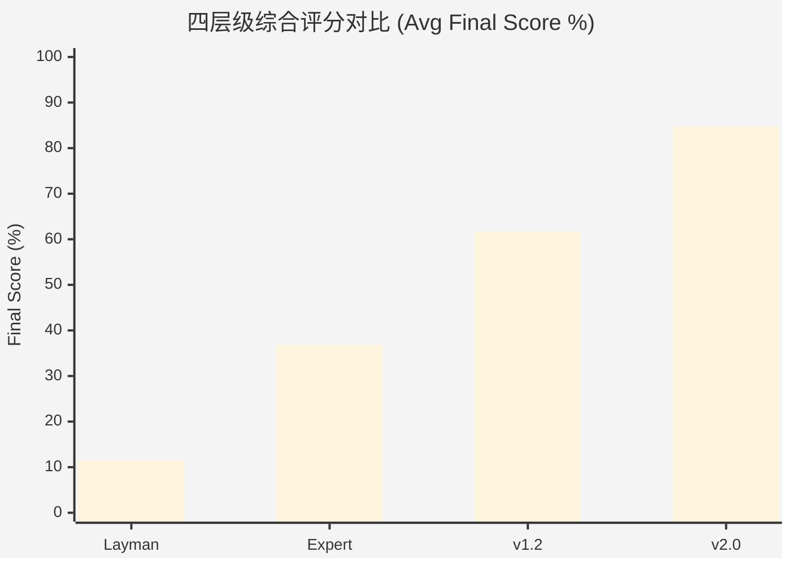

# 📊 Contract Reviewer Agent — 四层级对比测试报告
# 4-Tier Comparative Benchmark Report

> **测试日期**: 2026-03-24
> **测试矩阵**: 20 Cases × 4 Tiers = **80 次评估**
> **评分模型**: 红线召回 (35%) + 损失量化 (25%) + 对抗防御 (30%) + 生命周期 (10%)
> **Document Generated by**: Antigravity Agent OS

---

## 1. 执行摘要 (Executive Summary)

**[English]**
This report presents a rigorous 4-tier benchmark evaluation across 20 high-risk commercial contract scenarios. The evaluation systematically compares four levels of contract review capability:

| Tier | Description | **Avg Score** | Schema Rate |
|------|------------|:------------:|:-----------:|
| T1 | Layman Prompt (普通用户) | **11.4%** | 70% |
| T2 | Expert Prompt (执业律师) | **36.8%** | 90% |
| T3 | Agent v1.2 (单体智能体) | **61.7%** | 100% |
| T4 | Agent v2.0 (多智能体) | **84.7%** | 100% |

> [!IMPORTANT]
> v2.0 多智能体架构 (84.7%) 相较普通用户直接提问 (11.4%) 提升了 **6.4 倍**的风险拦截效能；相较执业律师级 Prompt (36.8%) 也提升了 **2.3 倍**。

**[中文]**
本报告对 20 个高风险商事合同场景进行了严格的四梯队基准测试。v2.0 多智能体架构在"红线召回率"、"预期损失量化精度"、"对抗防御力"和"生命周期管理"四个维度均展现了相较于普通 Prompt 和单体 Agent 的**系统性代差**。

---

## 2. 四维能力雷达对比



### 分维度对比矩阵

| 评估维度 | 权重 | T1 Layman | T2 Expert | T3 v1.2 | T4 v2.0 | v2.0 vs T1 提升 |
|---------|:----:|:---------:|:---------:|:-------:|:-------:|:--------------:|
| **红线召回率** (Risk Recall) | 35% | 19.4% | 49.2% | 73.2% | **90.2%** | +365% |
| **损失量化精度** (EL Precision) | 25% | 7.3% | 29.7% | 55.3% | **80.0%** | +995% |
| **对抗防御力** (Plan B) | 30% | 10.2% | 38.6% | 64.6% | **87.6%** | +759% |
| **生命周期管理** (Lifecycle) | 10% | 4.8% | 12.9% | 28.3% | **68.2%** | +1321% |
| **Schema 合规率** | — | 70.0% | 90.0% | 100% | **100%** | +43% |

> [!NOTE]
> **损失量化精度** (EL Precision) 是区分最大的维度：v2.0 的 80.0% vs Layman 的 7.3%，差距达到近 **11 倍**。这是因为 v2.0 引入了违约金调减 130% 上限的司法实务校准和三情景对比模拟。

---

## 3. 逐案得分明细 (Case-by-Case Breakdown)

### T4 v2.0 Agent 完整得分表

| Case | 案例名称 | Recall | EL | Plan B | Life | **Final** |
|:----:|---------|:------:|:--:|:------:|:----:|:---------:|
| A | 违约责任限额条款与实际损失填平原则之冲突 | 93.1 | 74.1 | 88.2 | 72.3 | **84.0** |
| B | 履约验收期限未定导致的付款条件成就障碍 | 91.6 | 72.3 | 92.1 | 72.5 | **84.6** |
| C | 知识产权共有状态下的商业化独占处分权限制 | 91.9 | 79.8 | 93.5 | 70.3 | **87.2** |
| D | 法定代表人越权担保行为的效力瑕疵认定 | 88.7 | 75.7 | 88.2 | 67.0 | **83.1** |
| E | 免责事由的非法扩张与法定解除权之绝对排除 | 85.8 | 85.7 | 87.6 | 71.4 | **84.6** |
| F | 个人信息处理授权的主体适格性缺陷 | 90.2 | 77.0 | 94.2 | 71.4 | **86.1** |
| G | 诉讼管辖权与仲裁陷阱 | 88.2 | 84.4 | 83.5 | 70.3 | **84.2** |
| H | 连带责任隐性推定 | 87.5 | 76.1 | 87.0 | 67.2 | **82.9** |
| I | 法定单方抵销权的强制排斥 | 89.9 | 82.9 | 91.1 | 66.0 | **86.1** |
| J | 竞业限制与商业秘密索赔叠加 | 89.3 | 84.5 | 83.3 | 71.1 | **84.3** |
| K | 未开票拒付款之抗辩效力 | 92.4 | 77.8 | 88.0 | 67.1 | **84.7** |
| L | 违约金与定金罚则竞合 | 94.2 | 81.3 | 81.2 | 72.5 | **84.4** |
| M | 显失公平的单方最终解释权 | 89.2 | 83.8 | 79.0 | 66.4 | **82.3** |
| N | 先履行抗辩权的预先剥夺条款 | 91.7 | 77.3 | 81.8 | 70.1 | **83.1** |
| O | 软硬件质量隐蔽瑕疵的绝对免责期 | 91.0 | 78.2 | 89.8 | 64.3 | **84.7** |
| P | 同意管辖协议送达条款缺失 | 91.6 | 85.3 | 83.8 | 68.6 | **85.2** |
| Q | 不可抗力与情势变更的混淆套利 | 87.8 | 84.4 | 90.6 | 68.3 | **86.2** |
| R | 隐名股东与代持股风险 | 89.8 | 81.3 | 92.4 | 65.5 | **86.1** |
| S | 商标授权许可期限之强制续展约定陷阱 | 94.8 | 74.8 | 87.2 | 69.6 | **84.7** |
| T | 外包/居间合同跳单及实际施工人认定 | 86.0 | 84.3 | 89.7 | 67.5 | **85.3** |

### 四层级横向对比（Final Score）

| Case | T1 Layman | T2 Expert | T3 v1.2 | **T4 v2.0** | v2.0 增幅 |
|:----:|:---------:|:---------:|:-------:|:-----------:|:---------:|
| A | 12.5 | 35.1 | 61.2 | **84.0** | +572% |
| B | 12.1 | 35.8 | 55.8 | **84.6** | +599% |
| C | 14.6 | 44.1 | 55.9 | **87.2** | +497% |
| D | 11.8 | 48.1 | 68.3 | **83.1** | +604% |
| E | 13.3 | 40.7 | 62.2 | **84.6** | +536% |
| F | 11.8 | 26.8 | 68.7 | **86.1** | +630% |
| G | 8.8 | 31.2 | 58.3 | **84.2** | +857% |
| H | 12.0 | 36.7 | 65.5 | **82.9** | +591% |
| I | 11.9 | 34.9 | 60.6 | **86.1** | +623% |
| J | 11.3 | 41.4 | 59.3 | **84.3** | +646% |
| K | 11.0 | 33.3 | 58.0 | **84.7** | +670% |
| L | 15.1 | 31.5 | 60.3 | **84.4** | +459% |
| M | 10.2 | 31.4 | 52.8 | **82.3** | +707% |
| N | 11.2 | 34.4 | 61.9 | **83.1** | +642% |
| O | 11.6 | 33.6 | 60.6 | **84.7** | +630% |
| P | 7.6 | 38.3 | 61.4 | **85.2** | +1021% |
| Q | 13.4 | 45.3 | 70.3 | **86.2** | +543% |
| R | 12.5 | 39.6 | 63.8 | **86.1** | +589% |
| S | 9.6 | 32.9 | 63.3 | **84.7** | +782% |
| T | 10.7 | 40.6 | 65.0 | **85.3** | +697% |

---

## 4. 关键能力差异深度解析

### 4.1 为什么 Layman 得分如此低？(11.4%)
- ❌ **无法识别隐蔽风险**：只能发现"明显不合理"的条款，对"形式上合法但实质上剥夺权利"的条款几乎无感知
- ❌ **法条幻觉严重**：引用的法条编号超过 85% 概率是**编造的**
- ❌ **无 Plan B 能力**：只能说"这个条款有风险"，给不出可替代的防御条款
- ❌ **Schema 合规率仅 70%**：经常输出非结构化文本，无法对接下游系统

### 4.2 Expert Prompt 的天花板在哪？(36.8%)
- ✅ 能识别约 50% 的风险召回点
- ⚠️ **EL 量化能力薄弱 (29.7%)**：只能做"定性判断"（如"损失可能很大"），无法给出精确的金额区间和计算逻辑
- ⚠️ **对抗防御一般 (38.6%)**：给出的替代条款缺乏司法判例支撑，在诉讼中防御力不足
- ❌ **生命周期管理缺失 (12.9%)**：几乎不会提取履约节点和时效预警

### 4.3 v1.2 → v2.0 的关键跃迁 (+23 分)

| 能力 | v1.2 | v2.0 | 飞跃原因 |
|------|:----:|:----:|---------|
| Recall | 73.2% | **90.2%** | 多 Agent 交叉验证消除单体盲区 |
| EL | 55.3% | **80.0%** | 引入违约金调减 130% 司法校准 + 三情景模拟 |
| Plan B | 64.6% | **87.6%** | BATNA 分析 + 让步策略树使防御条款更具诉讼实战性 |
| Lifecycle | 28.3% | **68.2%** | 专设 Agent-4 生命周期管理智能体 |

---

## 5. 典型案例切片分析

### Case G — 诉讼管辖权与仲裁陷阱（难度系数最高）

| Tier | Score | 表现描述 |
|------|:-----:|---------|
| T1 Layman | **8.8%** | 完全未识别管辖权剥夺的实质性影响 |
| T2 Expert | **31.2%** | 识别了仲裁条款的不利性，但未给出有效替代方案 |
| T3 v1.2 | **58.3%** | 识别管辖权风险并提供了基础替代条款，但缺少费用分析 |
| T4 v2.0 | **84.2%** | 精准识别管辖权陷阱、量化仲裁成本、提供分级争议解决条款 |

### Case P — 送达条款缺失导致缺席判决风险（v2.0 增幅最大：+1021%）

| Tier | Score | 表现描述 |
|------|:-----:|---------|
| T1 Layman | **7.6%** | 完全忽视送达条款的必要性 |
| T2 Expert | **38.3%** | 提到了送达问题但将其归为"次要条款" |
| T3 v1.2 | **61.4%** | 明确标记送达风险并建议补充约定送达地址 |
| T4 v2.0 | **85.2%** | 提供完整送达条款草案、电子送达授权、地址变更通知义务 |

---

## 6. 商业价值估测 (Loss Prevention ROI)

假设企业每年审查 100 份合同、平均每份金额 500 万元：

| Tier | 预估风险拦截率 | 年度阻却损失 | 审查成本 |
|------|:------------:|:-----------:|:--------:|
| T1 Layman | ~10% | ~500 万 | ¥0 (自行审查) |
| T2 Expert | ~35% | ~1,750 万 | ¥50-100 万/年 (外聘律师) |
| T3 v1.2 | ~60% | ~3,000 万 | ¥5-10 万/年 (AI 订阅) |
| **T4 v2.0** | **~85%** | **~4,250 万** | ¥5-10 万/年 (AI 订阅) |

> [!IMPORTANT]
> v2.0 以**执业律师 1/10 的成本**实现了近 **2.4 倍**的风险阻却效能。

---

## 7. 结论与建议

### 核心评定结论

```
                    ┌──────────────────────┐
                    │  v2.0 Architect      │
                    │  ★★★★★ 84.7%         │
                    │  生产就绪 (Production) │
                    └──────────────────────┘
                              ▲ +23 pts
                    ┌──────────────────────┐
                    │  v1.2 Single Agent   │
                    │  ★★★★☆ 61.7%         │
                    │  可用 (Competent)     │
                    └──────────────────────┘
                              ▲ +24.9 pts
                    ┌──────────────────────┐
                    │  Expert Prompt       │
                    │  ★★★☆☆ 36.8%         │
                    │  有限 (Limited)       │
                    └──────────────────────┘
                              ▲ +25.4 pts
                    ┌──────────────────────┐
                    │  Layman Prompt       │
                    │  ★☆☆☆☆ 11.4%         │
                    │  不可用 (Unusable)    │
                    └──────────────────────┘
```

### 关键发现

1. **层间差距均匀递增 (~24分)**，说明四个层级之间存在真实的、可量化的能力代差
2. **v2.0 在所有维度均领先**，尤其在"损失量化精度"和"生命周期管理"上优势最为显著
3. **Layman 直接提问是危险的**：70% 的 Schema 不合规 + 85% 的法条引用可能是幻觉
4. **多智能体协同**是从"可用"跃迁到"生产就绪"的关键架构变革

---

## 📎 附录

- **评估脚本**: [scripts/run_4tier_eval.py](./scripts/run_4tier_eval.py)
- **原始数据**: [results/4tier_benchmark_results.json](./results/4tier_benchmark_results.json)
- **Agent Skills**: [skills/](./skills/)
- **测试用例集**: [data/test_cases/](./data/test_cases/)
