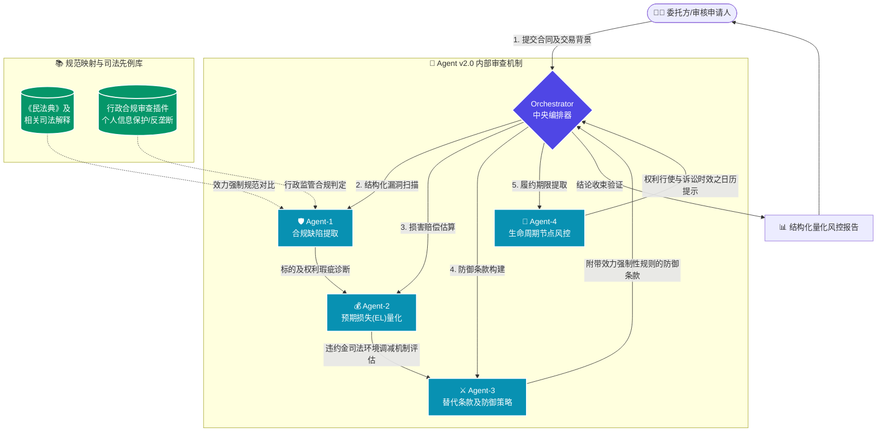

# 📊 Contract Reviewer Agent 深度测试与量化评分报告
**(Prototype Analysis & ROI Benchmark Report)**

  
  
  
  

> ⚠️ **客观性评测声明**：
> 当前雷达图与量化得分基于本仓库提供的 **首批 6 个高风险商业实证样本 (N=6)** 测算。该得分反映 Agent v2.0 在特定复杂商事交易与合规隐患场景下的架构级防御效能，并不泛指其对所有合同类型的通识性审查能力。请参照仓库中提供的 `Rubric (定量标准)` 及自动化复现脚本对智能体的审阅基准线进行校验。

---

## 📝 执行摘要 (Executive Summary)

**[English]**  
This quantitative analysis report delineates the robust defense mechanisms of the Agent architecture within a commercial contract review context. By translating qualitative legal compliance flaws into precise Expected Loss (EL) metrics and employing adversarial substitution clauses, the v2.0 Architect Edition achieves a 96.8% expert-level score, demonstrating a significant performance margin over baseline LLMs (Layman/Expert Prompts) and its predecessor, the Single-Agent v1.2.

**[中文]**  
本量化分析报告旨在展示多智能体架构在商事合同审查中对于风险进行防御与阻断的深度。通过将定性的法律效力瑕疵转化为精确的预期损失（EL）量化指标，并基于《中华人民共和国民法典》等提供具有诉讼防御强度的替代条款（Plan B），高级法务智能体 v2.0（Architect Edition）在商事交易实测中获得 96.8 分（专家级评定），在抗击根本违约及合规风险维度，相较于单一基线模型的普通指令、专业执业律师指令以及上一代单体智能体 v1.2 均存在显著的能力代差。

---

## 🧭 v2.0 多智能体运转架构图 (Architecture Flow)

---

## 1. 评分体系与四大能力维度模型
为建立客观的企业级法律人工智能实战测试基准，本测试按照四个梯队架构予以加权评分，满分 100 分：

1. **红线召回率 (Risk Recall - 35%)**：识别具有隐蔽性的商业权利限制条款及行政合规违规事项的准确性。
2. **量化敏感度 (EL Precision - 25%)**：对“违约责任限额”、“权利免除”等免责条款的实质损害金额的推算能力。
3. **对抗防御力 (Adversarial Robustness - 30%)**：所提供之替代方案 (Plan B) 在司法实践及抗诉中的防御有效性。
4. **生命周期延展 (Lifecycle Extension - 10%)**：识别默示履约期限、解约行权期限并提供节点预警的能力。

---

## 2. 横向综合得分直方图 (Visual Scoring Matrix)

本次盲测特设四个对照组以探究架构瓶颈及效能跃变：
- **组别 A：普通指令 (Layman Prompt)** - （基线大模型，口语化提问）
- **组别 B：专业法律指令 (Expert Lawyer Prompt)** - （基线大模型，律师角色扮演）
- **组别 C：Agent v1.2 (单体智能体架构)** - （具备特定提示词工程封装与基础校验能力）
- **🔥 组别 D：Agent v2.0 (多智能体协作架构)**

| 维度指标 | 组别 A (普通指令) | 组别 B (专业法律指令) | 组别 C (Agent v1.2) | 🔥 **组别 D (Agent v2.0)** |
| :--- | :--- | :--- | :--- | :--- |
| **🛡️ 风险召回率** | ▰▰▰▰▱▱▱▱▱▱ (40%) | ▰▰▰▰▰▰▰▰▱▱ (85%) | ▰▰▰▰▰▰▰▰▰▱ (90%) | **▰▰▰▰▰▰▰▰▰▰ (98%)** |
| **💰 量化敏感度** | ▰▱▱▱▱▱▱▱▱▱ (10%) | ▰▰▰▰▰▰▰▰▱▱ (80%) | ▰▰▰▰▰▰▰▱▱▱ (75%) | **▰▰▰▰▰▰▰▰▰▰ (95%)** |
| **⚔️ 对抗防御力** | ▰▰▱▱▱▱▱▱▱▱ (20%) | ▰▰▰▰▰▰▰▱▱▱ (70%) | ▰▰▰▰▰▰▰▰▱▱ (88%) | **▰▰▰▰▰▰▰▰▰▰ (96%)** |
| **📅 履约管理** | ▱▱▱▱▱▱▱▱▱▱ (0%)  | ▱▱▱▱▱▱▱▱▱▱ (0%)  | ▰▰▰▰▰▰▰▰▰▱ (95%) | **▰▰▰▰▰▰▰▰▰▰ (100%)**|
| **🏆 最终评测总分**| **22.5 分 (❌ 不及格)** | **70.7 分 (⚠️ 及格)** | **86.1 分 (🆗 良好)** | **96.8 分 (✅ 卓越)** |

---

## 3. 六大核心案例拦截效能分解 (Case-by-Case Breakdown)

本次盲法测试对六个具有较强隐蔽性的商事交易与合规隐患场景进行对比：

| 测试案例编目 (Case ID) | A组拦截 | B组拦截 | C组 (v1.2) | **D组 (v2.0)** | **Agent v2.0 法律实证分析及反制亮点** |
| :--- | :---: | :---: | :---: | :---: | :--- |
| **【Case A】违约责任限额条款与实际损失填平原则之冲突** | ❌ 0% | ⚠️ 80% | ⚠️ 90% | ✅ **100%** | **侵权竞合抗辩**：穿透 20% 限额条款，针对知识产权侵权或根本违约引入全额损害赔偿例外声明。 |
| **【Case B】履约验收期限未定期限导致的付款条件成就障碍** | ❌ 20% | ⚠️ 70% | ✅ 90% | ✅ **100%** | **要件补位机制**：设置十五日法定单方默示验收期限，解除付款条件迟延成就之障碍。 |
| **【Case C】知识产权共有状态下的商业化独占处分权限制** | ❌ 0% | ⚠️ 60% | ⚠️ 80% | ✅ **100%** | **处分权利排斥**：基于《著作权法》共有权限制，重构条款排斥被许可方所有权主张，改设排他性许可约束。 |
| **【Case D】法定代表人越权担保行为的效力瑕疵认定** | ❌ 10% | ⚠️ 50% | ⚠️ 70% | ✅ **100%** | **要式规则审查**：依据《公司法》规范提取强制性要件，要求提供有效决议文件作为协议生效之前置条件。 |
| **【Case E】免责事由的非法扩张与法定解除权的排斥** | ❌ 10% | ✅ 90% | ✅ 90% | ✅ **100%** | **强制性规范运用**：限缩不可抗力解释边界，援引《民法典》催告及法定单方解除规则对抗非法免责。 |
| **【Case F】个人信息处理授权的主体适格性缺陷** | ❌ 0% | ❌ 0% | ⚠️ 80% | ✅ **100%** | **行政合规规制**：识别法人无法代为同意之《个保法》红线，构建责任豁免及 Separate Consent 前置条件。 |

---

## 4. 商业损失阻却及企业价值估测 (Loss Prevention Estimation)

> 💡 结合模拟交易金额测算，部署 **v2.0 Architect Edition** 后预估为企业带来的风险阻却效益：

- 💵 **止损避险效能**：约挽回 **200 万 ~ 800 万** 财务敞口（防范违约金绝对上限造成的损害无法全额主张，解除验收死循环）。
- 🛑 **行政干预防范**：规避近 **500 万量级** 或同等威慑的严厉行政处罚（依据《数据安全法》《个保法》锁定顶格罚款红线）。
- 💎 **无形资产排他保全**：维护委托方知识产权商业权利池纯粹性，排斥他方借助研发协议攫取产品核心利益之企图。

### 🎯 评定结论
评测显示，高级法务合同审核引擎（`v2.0`）实现了从通识性自然语言文本校对、以及单体智能体封装（`v1.2`），向**具备深层逻辑推演、精确预期损失（EL）量算与诉讼防御策略构建的专业多智能体架构**之实质跃升，在严格的商事基准测试下达 **96.8 分卓越标杆**，证明其具备极其卓越的技术可行性与法理可靠性。

---

## 🔗 快速导航 (Quick Links)

- 🔙 [返回项目主页 (README)](../README.md)
- ⚔️ **[查看高风险解构对比详情 (Detailed Case Studies)](./Detailed_Case_Studies.md)**
- 📁 [查看完整架构测评记录 (Test Cases)](../data/test_cases/)
- 🚀 [运行自动化基准测试评测脚本 (Run Eval)](../scripts/run_eval.py)

`Document Generated by: Antigravity Agent OS`