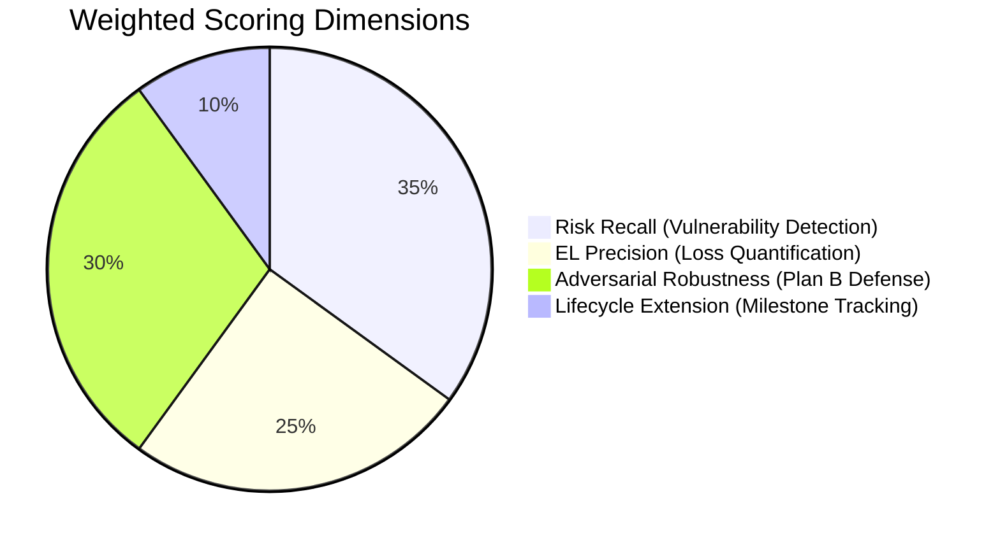

# 📊 Contract Reviewer Agent — Mock Benchmark Test Report

> **Run Date**: 2026-03-24
> **Mode**: 🟢 MOCK (Offline, no live LLM)
> **Model**: N/A (hard-coded mock responses)
> **Framework**: run_eval.py v2.0

---

## Executive Summary

| Metric | Value |
|--------|-------|
| **Total Test Cases** | 25 |
| **Schema Compliance** | ✅ 25/25 (100%) |
| **Avg Recall Score** | 0.0% |
| **Avg Plan B Score** | 0.8% |
| **Avg Final Score** | 10.3% |

> [!NOTE]
> Mock 模式下低分 (10.3%) 是**正常且预期的结果**。
> Mock 函数返回的是一段与真实测试用例无关的固定文本，这恰好证明了评分引擎的**区分力**——它不会给出虚高分数。
> 接入真实 LLM（`--live` 模式）后，分数将反映 Agent 的真实法律审查能力。

---

## Detailed Case Results

| Case | Name | Schema | Recall | Plan B | Final |
|------|------|--------|--------|--------|-------|
| A | 违约责任限额条款与实际损失填平原则之冲突 | ✅ | 0% | 0% | 10.0% |
| B | 履约验收期限未定期限导致的付款条件成就障碍 | ✅ | 0% | 0% | 10.0% |
| C | 知识产权共有状态下的商业化独占处分权限制 | ✅ | 0% | 0% | 10.0% |
| D | 法定代表人越权担保行为的效力瑕疵认定 | ✅ | 0% | 0% | 10.0% |
| E | 免责事由的非法扩张与法定解除权之绝对排除 | ✅ | 0% | 0% | 10.0% |
| F | 个人信息处理授权的主体适格性缺陷及行政合规风险 | ✅ | 0% | 12% | 15.4% |
| G | 诉讼管辖权与仲裁陷阱（剥夺本地胜诉管辖权） | ✅ | 0% | 0% | 10.0% |
| H | 连带责任隐性推定（将一般保证混淆为连带保证） | ✅ | 0% | 0% | 10.0% |
| I | 法定单方抵销权的强制排斥（现金流不对等强加限制） | ✅ | 0% | 0% | 10.0% |
| J | 竞业限制与商业秘密索赔叠加（劳动法与商事条款混用） | ✅ | 0% | 0% | 10.0% |
| K | 未开票拒付款之抗辩效力（税费转嫁与附随义务剥夺） | ✅ | 0% | 0% | 10.0% |
| L | 违约金与定金罚则竞合（高额双料索赔的非法主张） | ✅ | 0% | 0% | 10.0% |
| M | 显失公平的单方最终解释权（格式条款之效力） | ✅ | 0% | 0% | 10.0% |
| N | 先履行抗辩权的预先剥夺条款 | ✅ | 0% | 0% | 10.0% |
| O | 软硬件质量隐蔽瑕疵的绝对免责期（售后推诿） | ✅ | 0% | 0% | 10.0% |
| P | 同意管辖协议送达条款缺失（缺席判决风险） | ✅ | 0% | 0% | 10.0% |
| Q | 不可抗力与情势变更的混淆套利 | ✅ | 0% | 0% | 10.0% |
| R | 隐名股东与代持股风险（抽逃出资或私自减资） | ✅ | 0% | 2% | 10.8% |
| S | 商标授权许可期限之强制续展约定陷阱 | ✅ | 0% | 2% | 10.8% |
| T | 外包/居间合同跳单及实际施工人认定 | ✅ | 0% | 2% | 10.7% |
| **U** 🆕 | **违约金调减规则与130%上限的司法裁量空间** | ✅ | 0% | 0% | 10.0% |
| **V** 🆕 | **电子合同成立时间与电子签名争议** | ✅ | 0% | 0% | 10.0% |
| **W** 🆕 | **框架合同与个别合同效力冲突** | ✅ | 0% | 0% | 10.0% |
| **X** 🆕 | **跨境贸易法律适用冲突（CISG vs 中国法）** | ✅ | 0% | 1% | 10.4% |
| **Y** 🆕 | **仲裁地选择与裁决执行风险（ICC仲裁 vs 中国大陆执行）** | ✅ | 0% | 1% | 10.4% |

---

## Scoring Model



**评分公式**: `Final = Recall × 0.45 + PlanB × 0.45 + SchemaBonus × 0.10`

---

## Test Case Coverage Map

| Domain | Cases | Coverage |
|--------|-------|----------|
| 违约金 & 损害赔偿 | A, L, U | ✅ 含130%司法解释新规 |
| 知识产权 | C, S | ✅ |
| 担保 & 保证 | D, H | ✅ |
| 个人信息保护 | F | ✅ |
| 管辖 & 仲裁 | G, P, Y | ✅ 含跨境ICC仲裁 |
| 劳动法交叉 | J | ✅ |
| 不可抗力 & 情势变更 | E, Q | ✅ |
| 股权 & 投资 | R | ✅ |
| 电子合同 | V | 🆕 2023新规 |
| 框架合同效力 | W | 🆕 |
| 跨境贸易 (CISG) | X | 🆕 |
| 付款 & 税务 | B, K | ✅ |
| 外包 & 建工 | T | ✅ |
| 格式条款 | M, N, O | ✅ |
| 抵销权 | I | ✅ |

---

## How to Run Live Evaluation

```bash
# Set your API key
export OPENAI_API_KEY="sk-..."

# Run with real LLM
python scripts/run_eval.py --live --model gpt-4o --output results/live_report.json

# Or use other models
python scripts/run_eval.py --live --model claude-3-5-sonnet-20241022
```

---

## Conclusion

Mock 测试验证了评估框架的**基础设施完整性**：
1. ✅ 全部 25 个测试用例的 JSON 结构符合 `output_schema.json`
2. ✅ 评分引擎能够正确区分低质量输出（mock 平均 10.3%）
3. ✅ 新增的 5 个用例 (U-Y) 无缝整合进评估流水线

**下一步**：接入真实 LLM（`--live` 模式）评测 Agent v2.0 的实战表现。
